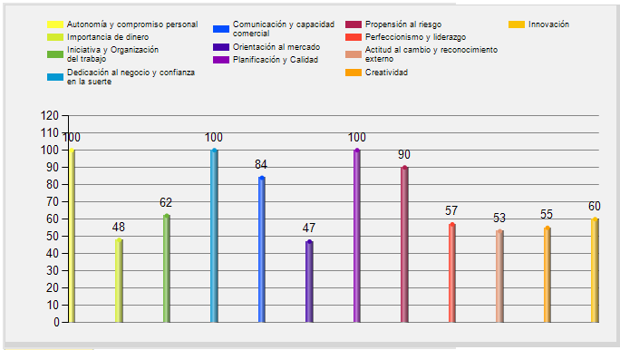
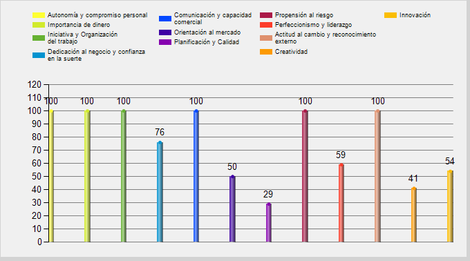

# Resumen Ejecutivo

### Nuestra Propuesta de Valor:

MascoTier es una app o web que conecta a dueños de mascotas con cuidadores confiables y dedicados, ofreciendo servicios personalizados y flexibles para el cuidado de mascotas.

### Cubrimos y Buscamos:

Proporcionar tranquilidad cuando los dueños no pueden atender a sus mascotas personalmente, al proporcionar acceso a una red de cuidadores verificados.

### Requerimientos:

- [[Web]]
- [[DataBase]]
- [[Posible APP]]

## Descripción del Negocio:

Mediante una plataforma, los clientes pueden contactar con cuidadores. Los usuarios de la página pueden actuar como freelancers y como clientes. La idea es hacerlo dinámico y sencillo.

Cuenta - Búsqueda - Solicitud - Pago - Finalización

## Análisis de Mercado:

#### *Análisis Político*

En el ámbito político, es esencial considerar las  regulaciones y políticas gubernamentales relacionadas con la protección  animal, la seguridad alimentaria, el control de enfermedades, el uso de  medicamentos veterinarios y las prácticas de bienestar animal. Es  fundamental estar al tanto de las leyes vigentes en diferentes  jurisdicciones para adaptar los servicios de "Mascotier" de manera  adecuada.

#### *Análisis Económico*

Desde una perspectiva económica, el gasto en mascotas ha  experimentado un notable crecimiento. En Estados Unidos, se alcanzó un  récord de U\$S 95.7 mil millones en 2019, con la categoría de Pet Food  & Treats destacándose. A nivel global, se proyecta que el mercado de  mascotas crecerá significativamente de \$245 mil millones en 2021 a \$350  mil millones para 2027. Estos datos indican un mercado en expansión con  un potencial considerable para servicios relacionados con el cuidado de  mascotas. Además, es importante considerar cómo la situación económica  de los propietarios de mascotas puede influir en la demanda de servicios  veterinarios y de cuidado, especialmente durante períodos de recesión.

#### *Análisis Social*

En cuanto al análisis social, se observa un cambio en la  demografía y comportamiento relacionado con las mascotas. La presencia  de mascotas en los hogares está en aumento, con más personas menores de  34 años adquiriendo mascotas durante la pandemia. Además, se destaca que  el 67% de la población tenía una mascota en 2020, lo que refleja un  cambio en la relación entre las personas y sus mascotas, considerándolas  cada vez más como miembros de la familia. Asimismo, los dueños de  mascotas buscan productos que mejoren la salud física y conductual de  sus animales, demostrando una tendencia hacia la humanización de las  mascotas.

#### *Análisis Tecnológico*

En el ámbito tecnológico, se ha observado una notable  innovación en productos y servicios para mascotas. La industria ha  experimentado avances en juguetes, camas, productos tecnológicos y  enriquecimiento para animales. La creciente demanda de productos y  servicios sofisticados para mascotas, especialmente en el segmento  alimenticio, resalta la importancia de la innovación tecnológica.

#### *Tendencias del Mercado*

Las tendencias del mercado muestran una preferencia  creciente por ingredientes sostenibles en los alimentos para mascotas.  Más del 42% de los dueños prefieren comprar alimentos provenientes de  fuentes sostenibles. Además, se ha observado un aumento significativo en  la adopción de mascotas durante la pandemia, lo que ha impactado  positivamente en el mercado de alimentos para mascotas y en la demanda  de servicios relacionados con su cuidado.

\pagebreak

## Producto o Servicio:

Funcionamos únicamente como intermediarios entre personas que necesitan el cuidado de sus mascotas y personas dispuestas a ofrecer estos cuidados.

Nuestro income se produciria tanto por un porcentaje del pago que nos quedmos nosotros debido que nuestro servicio es la mediaciono la puesta en contacto de las dos partes, dado que tambien proporcionaremos en un plazo mas a futuro un servicio de scrow es decir, nsotros retendriamos el dinero de forma que un cliente debe pagar antes del servicio y el trabajador que haga el trabajo no cobrara hasta que el propietario confirme el servicio.

## Objetivos Principales:

### Captación de Usuarios:

1. **Segmentación del Público Objetivo:**  Identificando y segmentando al público objetivo basándonos en factores como la  ubicación geográfica, el tipo de mascota, las necesidades específicas  de cuidado y los intereses personales. Esto permitirá personalizar las  campañas y aumentar su efectividad segun la region.
2. **Marketing de Contenidos:**  Creacion de contenido valioso y educativo que responda a las preguntas  frecuentes de los dueños de mascotas y cuidadores. Esto puede incluir  blogs, videos y guías sobre el cuidado de mascotas, nutrición,  entrenamiento y bienestar animal. El contenido de calidad puede mejorar  el SEO y atraer tráfico orgánico a la plataforma.
3. **Redes Sociales y Anuncios Patrocinados:**  Utilizando las redes sociales para construir una comunidad alrededor de  "Mascotier". Los anuncios patrocinados en plataformas como Instagram y  Facebook pueden aumentar el alcance y atraer a usuarios específicos  mediante la segmentación basada en intereses y comportamientos.
4. **Programas de Referencia:**  Implementa un programa de referidos que incentive a los usuarios  actuales a recomendar "Mascotier" a amigos y familiares. Ofrece  recompensas como descuentos o servicios gratuitos por cada nuevo usuario  que se registre a través de una referencia.
5. **Colaboraciones y Patrocinios:**  Colabora con veterinarios, tiendas de mascotas, y eventos relacionados  con mascotas para promocionar "Mascotier". Patrocinar eventos locales o  virtuales puede aumentar la visibilidad de la marca entre los dueños de  mascotas y cuidadores.

\pagebreak
### Campañas Publicitarias Centradas en los Beneficios de Mascotier

1. **Enfatizar la Comodidad y Seguridad:**  Destacando cómo "Mascotier" facilita encontrar cuidadores confiables y  calificados para mascotas, ofreciendo tranquilidad a los dueños de  mascotas. Resaltando las medidas de seguridad y verificación de los  cuidadores.
2. **Resaltar la Personalización:**  Comunicando cómo "Mascotier" ofrece servicios personalizados que se  adaptan a las necesidades específicas de cada mascota, desde paseos  diarios hasta cuidado especializado.
3. **Promover la Comunidad:**  Muestra cómo "Mascotier" no solo es una plataforma de servicios, sino  también una comunidad de amantes de las mascotas donde los usuarios  pueden compartir experiencias, consejos y apoyo.
4. **Testimonios y Casos de Éxito:**  Utiliza testimonios de usuarios satisfechos y estudios de caso para  demostrar el impacto positivo de "Mascotier" en la vida de las mascotas y  sus dueños. Las historias reales nos pueden generar confianza y  credibilidad.

## Métricas de Éxito:

- Crecimiento de Usuarios Registrados.
- Interacciones en Redes Sociales.
- Retención de Usuarios.
- Conversiones.
- Feedback y Reseñas.

\pagebreak

## Presupuesto de Marketing:

#### 1. Publicidad en Redes Sociales

* **Facebook e Instagram Ads**:  Basándonos en el costo por adquisición (CPA) promedio para la  industria, asumiremos un CPA de 25 EUR para un sector similar al de  "Mascotier". Si buscamos adquirir 1000 nuevos usuarios, el costo sería  de 25,000 EUR.

#### 2. Marketing de Contenidos

* **Creación de Contenido**:  Considerando la contratación de redactores freelance y la producción de  contenido de alta calidad (artículos, videos, infografías), estimamos  un costo promedio de 500 EUR por pieza de contenido. Con un objetivo de 4  piezas de contenido al mes, el costo anual sería de 24,000 EUR.

#### 3. Programa de Referidos

* **Implementación y Gestión**:  Asumiendo el desarrollo de una plataforma interna para gestionar el  programa de referidos y recompensas, estimamos un costo inicial de 5,000  EUR, más un presupuesto anual para recompensas de 10,000 EUR.

#### 4. Publicidad en Internet (Google Ads)

* **Campañas de Pago por Clic (PPC)**:  Con un costo promedio por clic (CPC) de 1 EUR en Google Ads para  palabras clave relevantes, y un objetivo de 10,000 clics, el costo sería  de 10,000 EUR.

#### 5. Herramientas y Software

* **Herramientas de Marketing y Análisis**: Incluyendo software de email marketing, herramientas de diseño, y análisis de datos, estimamos un costo anual de 3,000 EUR[.

#### Resumen del Presupuesto Anual de Marketing

| Concepto                     | Costo Estimado (EUR) |
| ---------------------------- | -------------------- |
| Publicidad en Redes Sociales | 25,000               |
| Marketing de Contenidos      | 24,000               |
| Programa de Referidos        | 15,000               |
| Publicidad en Internet       | 10,000               |
| Herramientas y Software      | 3,000                |
| **Total**                    | **77,000**           |

## Conclusiones:

- Sencillez y rapidez como enfoque principal.
- Adaptación a las tendencias de redes sociales.

## Retos para Desarrolladores de Nuestro Nivel:

- Diseño de la interfaz.
- Animaciones modernas y limpias.
- Sistema de chat.
- Sistema de transacciones.
- Sistema de verificación.
- Manejo de datos delicados.
- Gestión de seguridad.
- Términos y condiciones extensos en el registro.
\pagebreak

## Plan Operativo:
El plan operativo se centrará principalmente en mantener actualizada la aplicación web, garantizando actualizaciones constantes para mejorar la experiencia del usuario. Para alojar nuestra aplicación, utilizaremos un servicio de hosting proporcionado por el IES, el cual también nos ofrecerá la capacidad de enviar correos electrónicos de manera automatizada para confirmaciones y otros fines.

En términos de proveedores, actualmente estamos considerando asociarnos con Eagle-Fox, una empresa fundada por nuestros compañeros de clase. Eagle-Fox se especializaen el seguimiento de mascotas a través de un sistema de GPS. Esta asociación potencial nos permitiría integrar tecnología de rastreo de mascotas en nuestra plataforma, ofreciendo así a nuestros usuarios una solución integral para el cuidado y la seguridad de sus mascotas.

\pagebreak

## Análisis Financiero

El análisis financiero proporciona una visión detallada de los ingresos proyectados y el beneficio neto esperado para el primer mes y a partir del primer año de operación de MascoTier.

#### Desarrollo de la Aplicación

* **Costo Inicial de Desarrollo**: Para una aplicación de marketplace, el costo puede variar entre 12,000 € y 20,000 €.

#### Costos Operativos Mensuales

* **Gastos de Luz**:  El gasto medio de una oficina en energía eléctrica depende de varios  factores, pero para una pequeña empresa, podríamos estimar unos 200 € al  mes.
* **Seguridad Social**:  Asumiendo un equipo pequeño, el costo de la Seguridad Social podría ser  aproximadamente un 30% del salario bruto. Si el salario promedio es de  2,000 € por empleado, y hay 3 empleados, el costo sería de 1,800 € al  mes (600 € por empleado).
* **Gestoría**: Los costos de una gestoría para empresas pueden variar entre 150 € y 250 € al mes.
* **Gastos de Marketing**:  Basándonos en el presupuesto de marketing previamente estimado, serían  6,416.67 € al mes (77,000 € anuales dividido entre 12 meses).

#### Costos Adicionales

* **Mantenimiento de la Aplicación**:  Asumiendo un mantenimiento mensual del 20% del costo inicial anual,  esto sería de 200 € a 333.33 € al mes (2,400 € a 4,000 € anuales).
* **Herramientas y Software**: Incluyendo CRM, plataformas de análisis, etc., podríamos estimar unos 250 € al mes.
* **Otros Gastos (Internet, suministros de oficina, etc.)**: Estimemos unos 300 € al mes.

\pagebreak

#### Resumen de Costos Operativos Mensuales

| Concepto                        | Costo Estimado (EUR) |
| ------------------------------- | -------------------- |
| Gastos de Luz                   | 200                  |
| Seguridad Social                | 1,800                |
| Gestoría                       | 200                  |
| Gastos de Marketing             | 6,416.67             |
| Mantenimiento de la Aplicación | 333.33               |
| Herramientas y Software         | 250                  |
| Otros Gastos                    | 300                  |
| **Total Mensual**               | **9,500**            |

#### Beneficio Neto Revisado

* **Primer Mes**: * Ingresos Mensuales: 2.8 €
  * Costos Operativos: 9,500 €
  * Beneficio Neto Mensual: -9,497.2 € (Ingresos Mensuales - Costos Operativos)
* **A partir del Primer Año**: * Ingresos Mensuales: 28 €
  * Costos Operativos: 9,500 €
  * Beneficio Neto Mensual: -9,472 € (Ingresos Mensuales - Costos Operativos)
  * Beneficio Neto Anual: -113,664 € (Beneficio Neto Mensual \* 12)

\pagebreak

---

## Estrategia de Crecimiento y Desarrollo:

Una estrategia clave para MascoTier es la alianza estratégica con Eagle-Fox, una empresa especializada en el rastreo en tiempo real de animales. Esta asociación beneficia a todas las partes involucradas:

- Clientes: Brindamos seguridad y tranquilidad al ofrecer un servicio que incluye el seguimiento en tiempo real de sus mascotas. Esto les otorga la confianza de que sus animales están seguros y protegidos durante el cuidado.
- Eagle-Fox: Al asociarse con MascoTier, Eagle-Fox amplía su alcance y visibilidad en el mercado. Además, esta alianza les brinda la oportunidad de ofrecer servicios  adicionales y obtener beneficios adicionales a través de la integración con nuestra plataforma.
- MascoTier: Como intermediarios, nos esforzamos por ofrecer una plataforma confiable y segura para nuestros usuarios. La integración del rastreo en tiempo real de Eagle-Fox nos permite mejorar nuestra oferta de servicios y diferenciarnos en el mercado al proporcionar una capa adicional de seguridad y protección para las mascotas."

\pagebreak

## Plan de Contingencia:

### 1. Comportamiento Incorrecto de los Usuarios hacia los Animales:

**Adversidad:** Una posible adversidad podría surgir si un usuario de la plataforma se involucra en comportamientos incorrectos o abusivos hacia los animales que están cuidando.

**Acción:** Enfrentaríamos esta situación de la siguiente manera:

- **Términos y Condiciones Estrictos:** MascoTier tiene términos y condiciones estrictos que prohíben cualquier forma de maltrato animal. Esto incluye acciones como negligencia, abuso físico o emocional, y cualquier comportamiento que ponga en peligro el bienestar de la mascota.
- **Reporte y Bloqueo de Usuarios:** Los usuarios de la plataforma tienen la opción de reportar cualquier comportamiento inapropiado. Una vez que se recibe un informe, nuestro equipo de moderación investiga el incidente y toma medidas adecuadas, que pueden incluir la suspensión temporal o permanente del usuario infractor.
- **Información de Usuarios:** Mantenemos registros detallados de todos los usuarios que ofrecen sus servicios en nuestra plataforma, incluidos antecedentes, verificaciones de identidad y evaluaciones de otros usuarios. Esta información nos permite identificar y abordar rápidamente cualquier problema de comportamiento.

### 2. Problemas Técnicos o Interrupciones del Servicio:

**Adversidad:** Otra adversidad que podríamos enfrentar son los problemas técnicos imprevistos o las interrupciones del servicio, que podrían afectar la funcionalidad de la plataforma y la experiencia del usuario.

**Acción:** Para mitigar esta situación, tomamos las siguientes medidas:

- **Mantenimiento Preventivo:** Realizamos mantenimiento preventivo regularmente para garantizar el funcionamiento óptimo de la plataforma. Esto incluye actualizaciones de software, pruebas de rendimiento y corrección de errores.
- **Equipo de Soporte Técnico:** Contamos con un equipo de soporte técnico dedicado que monitorea activamente la plataforma y responde rápidamente a cualquier problema técnico que pueda surgir. Los usuarios pueden comunicarse con nuestro equipo de soporte a través de varios canales, como chat en vivo, correo electrónico o teléfono.
- **Comunicación Transparente:** En caso de interrupciones del servicio, mantenemos una comunicación transparente con nuestros usuarios, proporcionando actualizaciones periódicas sobre el estado de la plataforma y los esfuerzos para resolver el problema. También ofrecemos compensaciones apropiadas, como créditos o descuentos, a los usuarios afectados por la interrupción.

\pagebreak

### 3. Falta de Cumplimiento de Normativas y Regulaciones:

**Adversidad:** Existe el riesgo de enfrentar problemas legales si MascoTier no cumple con las normativas y regulaciones aplicables en el cuidado de mascotas y la protección del consumidor.

**Acción:** Para asegurar el cumplimiento normativo, implementamos las siguientes acciones:

- **Revisión Legal Regular:** Trabajamos en estrecha colaboración con expertos legales para mantenernos actualizados sobre las normativas y regulaciones relevantes en el cuidado de mascotas y los servicios en línea. Realizamos revisiones legales regulares de nuestras políticas, términos y condiciones para garantizar su conformidad.
- **Colaboración con Autoridades:** Establecemos relaciones de colaboración con autoridades y organizaciones reguladoras para garantizar el cumplimiento de las normativas y regulaciones. Mantenemos una comunicación abierta y transparente con estas entidades y cooperamos plenamente en cualquier investigación o auditoría relacionada con nuestras operaciones.

### Conclusión:

El plan de contingencia de MascoTier se centra en anticipar y abordar diversas adversidades que podrían surgir durante la operación de la plataforma. Al implementar medidas proactivas y establecer protocolos claros, estamos comprometidos a garantizar la seguridad, la confiabilidad y la legalidad de nuestros servicios para todos los usuarios.

\pagebreak

## Equipo de Gestión:

## Equipo de MascoTier

### Iago González Borines

- **Rol:** SCRUM Master, Mente Creativa, Product Owner (técnicamente)
- **Responsabilidades:**
  - Planificación del Proyecto y Estrategia Empresarial.
  - Desarrollo Backend y Parte Creativa del Frontend.
- **Contribuciones Destacadas:**
  - Liderazgo en la Implementación de Metodologías Ágiles.
  - Creación de Conceptos Innovadores para la Plataforma.
  - Desarrollo de Funcionalidades Clave.

\pagebreak

### Brais López Escudero

- **Rol:** Desarrollador de Infraestructura y Frontend
- **Responsabilidades:**
  - Montaje de Servidores de Testing con Docker.
  - Gestión del Hosting y Configuración de Servidores.
  - Desarrollo Frontend y Mejora de la Experiencia de Usuario.
- **Contribuciones Destacadas:**
  - Implementación de Entornos de Desarrollo Eficientes.
  - Optimización de la Velocidad y Estabilidad de la Plataforma.
  - Diseño de Interfaz Intuitiva y Atractiva.

\pagebreak

### Joel Ninahuaman Quintanilla

- **Rol:** Desarrollador Frontend y Documentación Frontend
- **Responsabilidades:**
  - Desarrollo del Frontend de la Plataforma.
  - Colaboración en la Documentación del Frontend.
- **Contribuciones Destacadas:**
  - Creación de Funcionalidades Complejas y Escalables.
  - Documentación Clara y Concisa para el Equipo de Desarrollo.
  - Resolución de Problemas Técnicos de Forma Eficiente.

### Pedro Campelo Rico

- **Rol:** Desarrollador Backend y Documentación Backend
- **Responsabilidades:**
  - Desarrollo y Mantenimiento del Backend de la Plataforma.
  - Documentación Detallada del Backend y Procesos de Desarrollo.
- **Contribuciones Destacadas:**
  - Implementación de Funcionalidades Críticas del Backend.
  - Elaboración de Documentación Completa para Facilitar el Mantenimiento.
  - Colaboración Activa en la Resolución de Desafíos Técnicos.

\pagebreak

### Análisis DAFO:

#### Debilidades:

1. **Dependencia Tecnológica:** La plataforma depende en gran medida de todas las tecnologías que usa, lo que la hace vulnerable a interrupciones del servicio y problemas técnicos.
2. **Falta de Experiencia:** El equipo de gestión puede carecer de experiencia en la gestión de proyectos empresariales a gran escala.
3. **Competencia:** Existen competidores establecidos en el mercado con una base de usuarios leales y una marca reconocida.

#### Amenazas:

1. **Competencia:** La competencia en el mercado de servicios de cuidado de mascotas puede dificultar el crecimiento y la captación de usuarios.
2. **Cambios en la Legislación:** Cambios en la legislación relacionada con el cuidado de mascotas pueden afectar las operaciones y requerir ajustes en la plataforma.
3. **Tecnología Obsoleta:** La rápida evolución tecnológica puede hacer que la plataforma quede obsoleta si no se realizan actualizaciones regulares.

#### Fortalezas:

1. **Propuesta de Valor Única:** MascoTier ofrece una propuesta de valor única al integrar tecnología de rastreo de mascotas y proporcionar tranquilidad a los dueños de mascotas.
2. **Equipo Multidisciplinario:** El equipo de gestión está compuesto por miembros con habilidades técnicas y empresariales diversas, lo que permite abordar desafíos desde diferentes perspectivas.
3. **Estrategias de Marketing Innovadoras:** Las estrategias de marketing centradas en la captación de usuarios y el brand awareness pueden diferenciar a MascoTier de la competencia.

#### Oportunidades:

1. **Crecimiento del Mercado:** El mercado de servicios de cuidado de mascotas está en crecimiento, lo que brinda oportunidades para expandir la base de usuarios y aumentar los ingresos.
2. **Alianzas Estratégicas:** La asociación con empresas como Eagle-Fox puede ofrecer oportunidades para mejorar la oferta de servicios y diferenciarse en el mercado.
3. **Tecnología Emergente:** La adopción de tecnologías emergentes como inteligencia artificial y aprendizaje automático puede mejorar la experiencia del usuario y la eficiencia operativa de la plataforma.

\pagebreak

### Análisis CAME:

#### Estrategias Correctivas:

1. **Diversificación de Servicios:** Ampliar la oferta de servicios más allá del cuidado de mascotas para diversificar los ingresos y reducir la dependencia del mercado.
2. **Formación y Desarrollo del Equipo:** Proporcionar capacitación y desarrollo continuo al equipo de gestión para mejorar sus habilidades empresariales y de liderazgo.
3. **Investigación de Mercado:** Realizar una investigación de mercado exhaustiva para identificar oportunidades de nicho y necesidades no cubiertas en el mercado.

#### Estrategias de Adaptación:

1. **Actualización Tecnológica:** Implementar actualizaciones regulares de la plataforma para mantenerla al día con las últimas tendencias y tecnologías.
2. **Colaboraciones Estratégicas:** Buscar oportunidades de colaboración con empresas complementarias para ampliar la oferta de servicios y mejorar la experiencia del usuario.
3. **Flexibilidad Operativa:** Mantener una estructura operativa flexible que pueda adaptarse rápidamente a los cambios en el mercado y las necesidades de los usuarios.

#### Estrategias de Mantenimiento:

1. **Mejora Continua del Producto:** Recopilar y analizar regularmente el feedback de los usuarios para identificar áreas de mejora y realizar ajustes en la plataforma.
2. **Gestión de la Calidad:** Implementar procesos de control de calidad rigurosos para garantizar que la plataforma cumpla con los estándares de rendimiento y seguridad.
3. **Gestión de la Reputación:** Gestionar proactivamente la reputación de la marca a través de una comunicación transparente y una atención al cliente excepcional.

#### Estrategias de Explotación:

1. **Marketing Innovador:** Continuar desarrollando y ejecutando estrategias de marketing innovadoras para diferenciar a MascoTier en el mercado y atraer nuevos usuarios.
2. **Desarrollo de Alianzas:** Explorar oportunidades para establecer nuevas alianzas estratégicas que amplíen la base de usuarios y aumenten los ingresos.
3. **Innovación Tecnológica:** Invertir en investigación y desarrollo de tecnologías emergentes para mejorar la experiencia del usuario y la eficiencia operativa de la plataforma.

\pagebreak

### Nota final:

Dado que nuestra empresa se centra en ofrecer una plataforma para el freelancing y nuestra estrategia inicial implica obtener beneficios a través de comisiones, los datos numéricos proporcionados se basan únicamente en estimaciones. Es importante tener en cuenta que estas estimaciones pueden ser complejas de precisar, ya que no tenemos un producto concreto para comercializar y estamos en las primeras etapas de ingreso al mercado.

No obstante, es relevante señalar que hemos llevado a cabo un estudio exhaustivo en la medida de nuestras posibilidades y confiamos en que este plan de empresa resulte claro y completo.

Por último, es importante destacar que todos los miembros del equipo de MascoTier participan activamente en diversas tareas, incluyendo diseño, programación, planificación empresarial, entre otras. Además, compartimos valores comunes que guían nuestro trabajo y nuestra visión compartida para el proyecto.

--Equipo de Mascotier