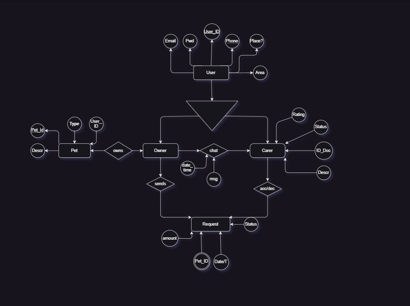

## Entity-relation model 

## Relational model

User (User_ID,Email,Pwd,Phone, Place, Area)
    Owner(User_ID)
    Carer(User_ID,Rating,Status,ID_Doc,Descr)

Pet(Pet_ID,User_ID,Descr,Type)

Chat(User_ID,User_ID,msg,date_time)
Request(Pet)

